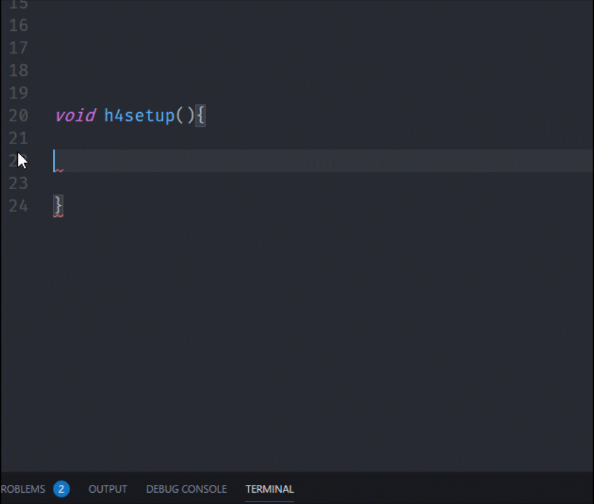

# H4-snippets

H4/H4Plugins made it easier for one to program ESP8266, ESP32, Raspberry Pi and STM32.

And this extension Makes the life easier and coding faster with H4/H4Plugins framework.

## Features

Auto-completion code and ready-snippets to work with H4 functions and their own parameters.

Also supports H4/H4Plugins callback function types

## Requirements

To get the best use of this extension :
install PlatformIO extension
Add H4 framework : 
- By PlatformIO libraries or its own github [repository](https://github.com/philbowles/H4)

## Release Notes

### 0.1.0
Update existing snippets due to H4P version 0.5.5
Add H4Basic Constructor

### 0.0.2
Fix GPIO Callback

### 0.0.1
Initial release of H4 snippets for vscode.
